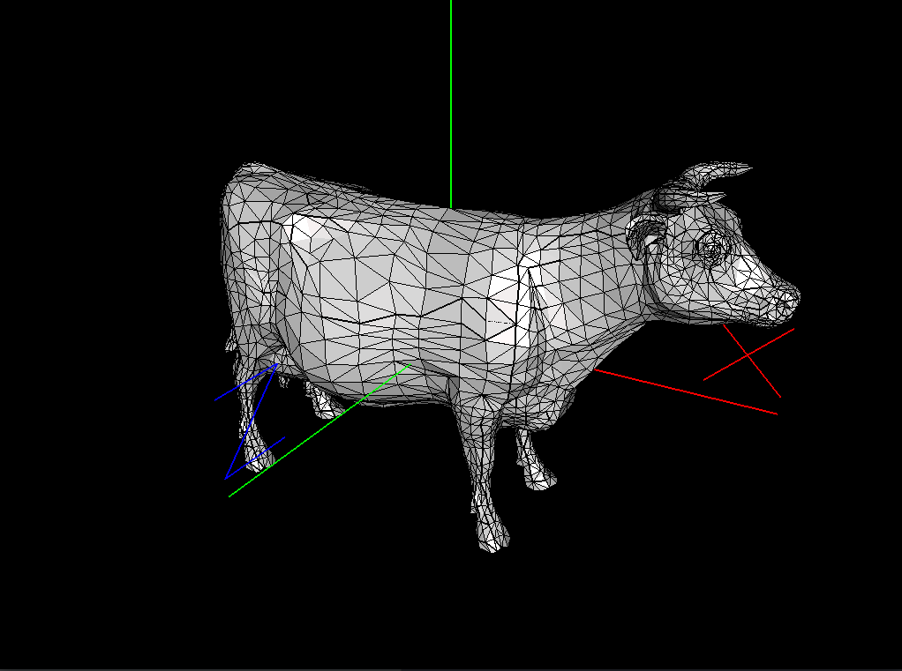

# OpenGL OBJ Visualizer

## Introduction

The fifth TP is about creating a visualizer for models loaded from [Wavefront OBJ format](https://en.wikipedia.org/wiki/Wavefront_.obj_file) files. 
It also lets you implement a simple subdivision model of the mesh using Loop's algorithm.

The application lets you navigate the scene and change the different rendering algorithms.
The keys are:

* `s` - use index rendering
* `w` - draw wireframe
* `s` - enable/disable subdivision
* `1`-`4` - with subdivision enabled, level of subdivision
* `d` - enable/disable solid rendering
* `a` - enable/disable smooth rendering
* `arrow keys` - rotate around the object
* `pg down/up` - zoom out/in

The folder [data/models](data/models) contains some 3D models to play with.

## Building

See [BUILD](BUILD.md) text file

## License

See [LICENSE](LICENSE) text file

## Authors

Simone Gasparini

## Contact

Simone Gasparini simone.gasparini@irit.fr
